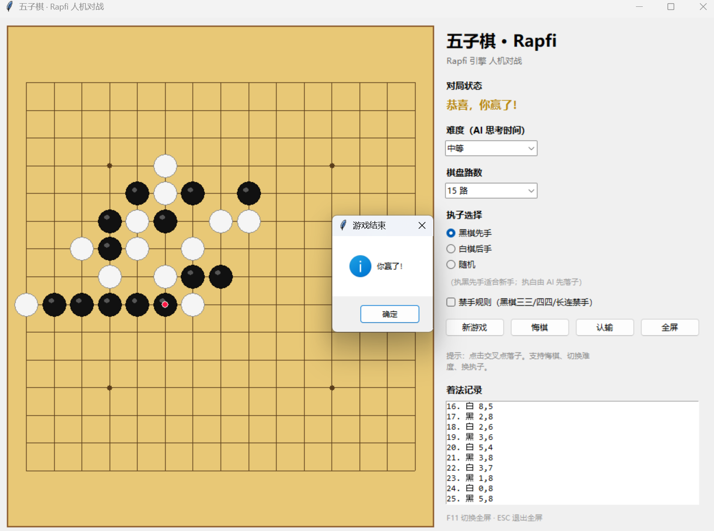

# 五子棋 · Rapfi 人机对战

基于 Python + Tkinter 的五子棋人机对战桌面程序，内置开源强引擎
[Rapfi](https://github.com/dhbloo/rapfi)（Gomocup/Piskvork 协议通信）。
仅依赖 Python 标准库，无需安装第三方包，开箱即玩。


---

## 功能特性

- **人机对战**：点击棋盘交叉点落子，先连成五子者获胜
- **先后手可选**：执黑先手 / 执白后手（AI 先落子）/ 随机
- **双棋盘规格**：15 路 / 19 路一键切换
- **连珠禁手规则**：可选启用，仅约束黑棋（三三、四四、长连禁手）
- **四档难度**：简单 / 中等 / 困难 / 极难（由引擎思考时间与搜索强度控制，
  极难满载全部 CPU 核心、512MB 置换表，接近比赛强度）
- **对局操作**：新游戏 / 悔棋 / 认输
- **最近一手高亮**：红点标记最新落子，一眼看清 AI 下在哪里
- **着法记录**：右侧实时列出每一步
- **自适应界面**：窗口自由缩放，棋盘始终保持正方形并居中
- **全屏模式**：`F11` 切换全屏，`ESC` 退出
- **多指令集引擎自动适配**：内置 SSE2 / AVX2 / AVX-512 / AVX-VNNI / AVX-512VNNI
  五个版本，启动时自动探测当前 CPU 可运行的最优版本，兼容从老款到最新的各类 x86-64 CPU

## 界面预览

> 可将运行截图放入 `docs/screenshot.png` 并在此引用：
>
> ```markdown
> 
> ```

## 快速开始

### 环境要求

- **Python 3.8+**（推荐 3.10 及以上）
- Tkinter（Windows / macOS 官方安装包自带；Debian/Ubuntu 需 `sudo apt install python3-tk`）
- 本项目**不依赖任何第三方 Python 包**

### 源码运行

```bash
git clone https://github.com/<你的用户名>/<仓库名>.git
cd <仓库名>
python gomoku.py
```

> 引擎可执行文件位于 [`engine/`](engine/) 目录，源码运行时会自动加载。
> 仓库默认内置 **Windows 版**引擎；macOS / Linux 用户请参考下文
> [更换引擎](#引擎与-cpu-兼容性) 一节替换为对应平台二进制。

## 引擎与 CPU 兼容性

对战 AI 使用开源五子棋引擎 [Rapfi](https://github.com/dhbloo/rapfi)，
通过 Gomocup/Piskvork 文本协议以子进程方式通信。`engine/` 目录内置
2025-06-15 版 Windows 预编译引擎及神经网络模型：

| 引擎版本 | 适用 CPU |
| --- | --- |
| `pbrain-rapfi-windows-avx512vnni.exe` | 支持 AVX-512 + VNNI 的最新高端 Intel/AMD |
| `pbrain-rapfi-windows-avxvnni.exe` | Intel 11 代及以后（AVX-VNNI） |
| `pbrain-rapfi-windows-avx512.exe` | 支持 AVX-512 的 CPU |
| `pbrain-rapfi-windows-avx2.exe` | 2013 年后 Intel / 2015 年后 AMD（主流） |
| `pbrain-rapfi-windows-sse.exe` | 几乎所有 64 位 x86 CPU（兜底兼容） |

程序按 `AVX-512VNNI → AVX-VNNI → AVX-512 → AVX2 → SSE2` 顺序实际启动探测，
选中第一个能正常响应的版本，无需手动指定。若所有版本都被安全软件拦截，
会弹出明确的中文提示。

### 更换 / 更新引擎

1. 前往 Rapfi [Releases 页面](https://github.com/dhbloo/rapfi/releases)下载对应平台压缩包；
2. 将引擎二进制（及 `*.bin`/`*.lz4` 模型、`config.toml`）放入 `engine/` 目录；
3. 若文件名不同，同步修改 `gomoku.py` 顶部的 `ENGINE_CANDIDATES` 列表。

## 打包为 Windows 可执行文件（exe）

使用 [PyInstaller](https://pyinstaller.org/) 将程序与引擎打包为免安装 exe：

```bash
pip install pyinstaller
pyinstaller --noconfirm --clean --onedir --windowed ^
    --name "五子棋" ^
    --add-data "engine;engine" ^
    gomoku.py
```

- Windows 下 `--add-data` 的分隔符为分号 `;`（macOS/Linux 为冒号 `:`）
- 产物在 `dist/五子棋/` 目录，**分发时需整个文件夹一起拷贝**（exe 与 `_internal` 配套）
- 也可直接运行仓库内的 [`build.bat`](build.bat) 一键打包（仅 Windows）

## 操作说明

| 操作 | 方式 |
| --- | --- |
| 落子 | 鼠标左键点击棋盘交叉点 |
| 切换难度 / 路数 / 执子 / 禁手 | 右侧控制面板（对局中部分选项会开启新局） |
| 新游戏 / 悔棋 / 认输 / 全屏 | 右侧按钮 |
| 全屏切换 | `F11` |
| 退出全屏 | `ESC` |

### 禁手规则

勾选「禁手规则」后启用连珠规则，**仅黑棋受限**（白棋无禁手）：

- **三三禁手**：一步同时形成两个及以上活三，该点禁止落子
- **四四禁手**：一步同时形成两个及以上的四（活四 / 冲四），禁止落子
- **长连禁手**：形成 6 子及以上连珠不计胜利
- **五连优先**：若一步同时形成五连与禁手，五连优先，黑棋获胜

玩家执黑点击禁手点会被拒绝并提示原因；AI 执黑时由引擎自动规避禁手。

## 项目结构

```
.
├── gomoku.py          # 程序全部源码（界面 + 引擎通信 + 规则判定，单文件）
├── engine/            # Rapfi 引擎二进制与神经网络模型
│   ├── pbrain-rapfi-windows-*.exe   # 五种指令集版本
│   ├── *.bin / *.lz4               # 引擎模型文件
│   ├── config.toml                 # 引擎配置
│   └── AUTHORS                     # Rapfi 作者名单
├── build.bat          # Windows 一键打包脚本
├── requirements.txt   # 依赖说明（运行本身无第三方依赖）
├── LICENSE            # GPL-3.0 许可证
├── .gitignore
└── README.md
```

## 常见问题

**Q：启动后提示「引擎未返回走法 / 无法启动引擎」？**
A：多为杀毒软件或 Windows 智能应用控制（Smart App Control）拦截了 `engine/` 下的
引擎程序。请将程序目录加入杀软白名单，或在「Windows 安全中心 → 应用和浏览器控制」
中调整智能应用控制设置后重试。程序运行日志写入 `gomoku.log`，可据此排查。

**Q：运行时为什么没有黑色命令行窗口？**
A：引擎子进程已通过 `CREATE_NO_WINDOW` 隐藏运行，属正常现象。

**Q：极难难度 AI 思考时界面会卡吗？**
A：不会。引擎运行在独立子进程 + 后台线程中，思考期间界面仍可响应。

**Q：能自己改难度参数吗？**
A：可以。`gomoku.py` 顶部的 `DIFFICULTY`（每档思考毫秒数）与
`ENGINE_THREADS` / `ENGINE_HASH_KB` 等常量均可调整。

## 致谢

- [Rapfi](https://github.com/dhbloo/rapfi) —— 强大的开源五子棋/连珠引擎（GPL-3.0）
- [Gomocup](https://gomocup.org/) —— Piskvork/Gomocup 通信协议标准

## 开源协议

本项目基于 [GNU General Public License v3.0](LICENSE) 开源。由于内置并依赖
GPL-3.0 的 Rapfi 引擎，分发本程序（含打包后的二进制）时须同样遵循 GPL-3.0，
并保留源码开放义务。Rapfi 引擎的版权归其原作者所有，详见 [`engine/AUTHORS`](engine/AUTHORS)。
